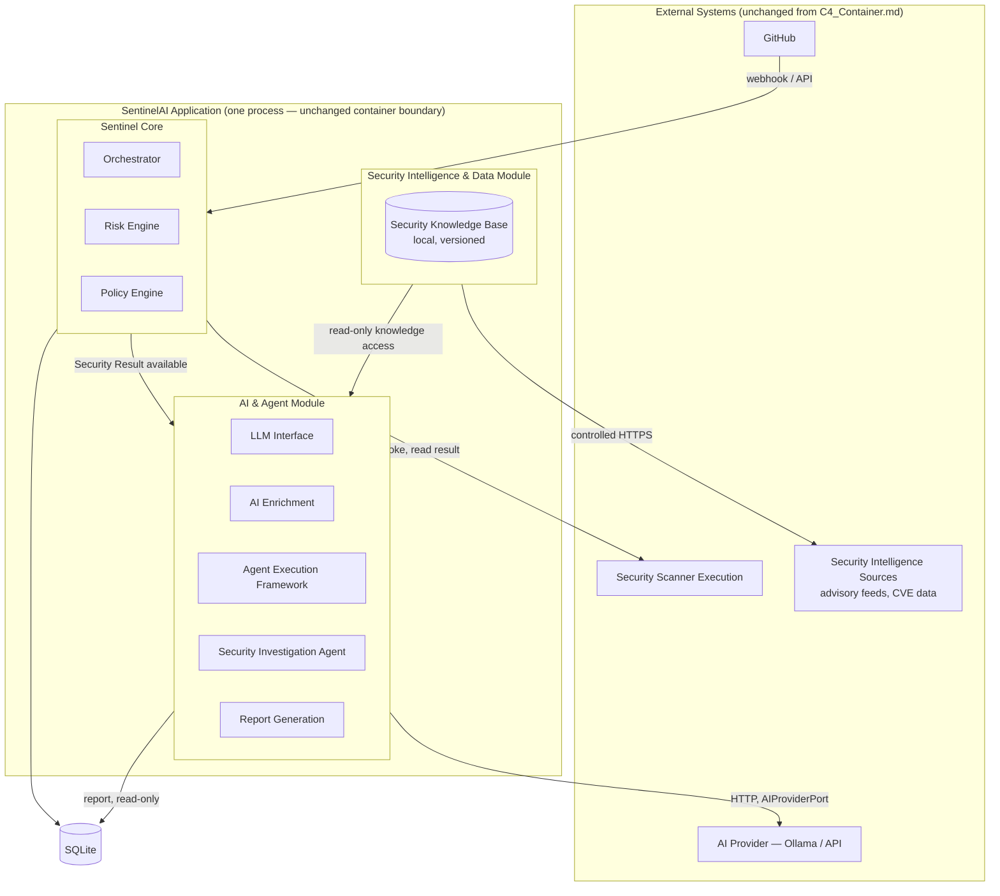
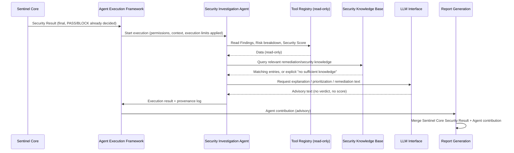

# AI Agent Architecture

## 1. Purpose

This document defines how the AI/LLM and agentic capabilities of SentinelAI are structured, bounded, and governed. It elaborates — without contradicting — the container model in `C4_Container.md` and the term definitions in `Ubiquitous_Language.md`. Its scope is: the three-module split that isolates network access and decision authority, the internal composition of the AI & Agent Module, the reusable Agent Execution Framework, the Security Investigation Agent's execution model, and how AI/agent behavior stays auditable and never authoritative over the security verdict.

This document does **not** redesign the C4 container boundaries, does not introduce new deployable services, and does not open new architectural decisions requiring an ADR — it specifies internal structure within the existing `SentinelAI Application` container.

## 2. Scope & Non-Goals

**In scope**: module boundaries for network/decision isolation; LLM's role as an interpreter, never a decider; the Agent Execution Framework as reusable infrastructure; the Security Investigation Agent's permissions and execution timing; the Security Knowledge Base; LLM/agent degradation behavior; provenance and auditing.

**Non-goals**: splitting SentinelAI into microservices (the modules below are internal boundaries inside one process, consistent with `Architecture_Overview.md`'s modular-monolith style); changing who produces PASS/BLOCK (still Policy, per P-02/P-04); designing future agents beyond the extension mechanism; formal ADRs (any decision here that later proves to need one is raised separately, not created here).

## 3. Module Boundaries

SentinelAI's internal structure is organized into three modules, each with a distinct trust and network profile. This is a refinement of the internal composition of the `SentinelAI Application` container from `C4_Container.md` — the container-level diagram, its external relationships (GitHub, Scanner Execution, AI Provider, SQLite), and the process boundary are unchanged.

| Module | Internet access | Decision authority | Primary responsibility |
|---|---|---|---|
| **Security Intelligence & Data Module** | Yes — the only module with controlled outbound access | None | Acquires and refreshes external security/remediation knowledge; stores it securely for internal use |
| **Sentinel Core** | No | Full — sole authority for PASS/BLOCK | Classification, scanner coordination, normalization, correlation, risk assessment, security score, policy evaluation |
| **AI & Agent Module** | No general access — only the single, pre-configured AI Provider endpoint | None | LLM-based interpretation, AI Enrichment, Agent Execution Framework, Security Investigation Agent, report generation |

**Why this split**: the only module allowed to reach arbitrary external hosts is the one whose job is exactly that — acquiring security intelligence. Sentinel Core, which owns the deterministic verdict, has no network dependency beyond the scanner subprocesses and persistence already defined in `C4_Container.md`, so nothing in the decision path can be influenced by network conditions or external content. The AI & Agent Module's only egress is the single, explicitly configured `AIProviderPort` endpoint — it does not browse, fetch, or call anything else, so a compromised or hallucinating LLM interaction cannot be used to exfiltrate data or reach arbitrary infrastructure.

## 4. AI & Agent Module — Internal Composition

### LLM Interface / AI Enrichment
Unchanged in function from `Security_Decision_Flow.md` and P-02: the LLM receives correlated Findings (and, for the agent flow below, the full Security Result) and returns advisory text — explanation, consequence framing, prioritization guidance, remediation suggestions. Its output type has no field capable of expressing a Security Score or a PASS/BLOCK verdict, and no code path reads LLM output as an input to Risk or Policy. The LLM **interprets already-generated information**; it does not generate the information that matters for the decision.

### Agent Execution Framework
A reusable internal framework, not built specifically for one agent. It provides:

- **Agent Registry** — the set of agents SentinelAI can run, each declared with its role, allowed execution window, and permission profile. The Security Investigation Agent is the first entry.
- **Tool Registry** — the internal, authorized tools an agent may call (e.g., "read Finding detail," "read Security Score breakdown," "read Security Knowledge Base entry"). Tools are read-only accessors into data Sentinel Core already produced — never scanner invocations, never write operations.
- **Permissions** — a per-agent allow-list mapping the agent to the exact tools and data it may access; anything not explicitly listed is denied by default.
- **Context/State** — the bounded input an agent execution receives (the Security Result, relevant Findings, Security Knowledge Base entries) and any intermediate state during a single run; state does not persist or leak across Analyses.
- **Guardrails** — structural constraints enforced independent of agent/LLM behavior (Section 7).
- **Execution limits** — bounded run time, bounded tool-call count, bounded output size per agent execution, so a misbehaving or looping agent cannot stall report generation indefinitely.
- **Auditing** — every agent execution, tool call, and output is logged with provenance (Section 9).

**Extensibility**: a future agent is added by registering it (role, permission profile, allowed tools, execution window) — the framework's registry, permission, guardrail, and auditing mechanics do not change per agent. This is the same intent as P-07 (provider independence) applied to agents: new capability by configuration, not by redesign.

### Security Investigation Agent
The first and, for the MVP, only registered agent. Its role is to **investigate and explain**, not to test or execute.

- **When it runs**: after Sentinel Core has completed deterministic evaluation and produced a Security Result — primarily during report generation, not during scanning or policy evaluation.
- **What it does**: reads Findings, the Security Score breakdown, Risk context, and relevant Security Knowledge Base entries; validates and cross-references this already-produced data; asks the LLM to synthesize explanations, likely consequences, prioritization, and remediation guidance for the DevSecOps-facing report.
- **What it does not do**: it does not orchestrate or re-run scanners, does not query the network, does not modify any Finding, Risk value, Security Score, or Policy outcome, and does not execute the internal tools it reads from a second time in a way that mutates state — every Tool Registry entry available to it is read-only by construction.

### Report Generation
Consumes the Security Result (from Sentinel Core, authoritative and already final) plus the Security Investigation Agent's output (advisory, explanatory) to produce the Developer and DevSecOps Report representations defined in `Ubiquitous_Language.md`. Report generation can proceed with a partial or missing agent contribution — see Section 8.

## 5. Security Investigation Agent — Execution Flow

The Security Result entering this flow is already final. Nothing in this sequence can alter it — the flow only adds explanatory content on top of a decision Sentinel Core already made independently.

## 6. Security Knowledge Base

A local, versioned store of security and remediation knowledge, populated and refreshed by the Security Intelligence & Data Module. It is the **only** external-knowledge source the Security Investigation Agent may draw on, alongside the scanner results and Security Result context already available to it.

- **Versioned**: entries carry a version so a recommendation can be traced back to the knowledge state at the time it was made — relevant for Auditing (Section 9) and consistent with how Policy versions are already tracked.
- **Local**: the Agent never queries the internet directly to answer "how do I fix this" — it queries this local store, which was populated ahead of time by the one module allowed to reach external sources.
- **Bounded honesty**: if the Knowledge Base has no sufficient entry to support a remediation recommendation for a given Finding, the Agent must say so explicitly in the report (e.g., "no verified remediation guidance available for this finding") rather than have the LLM invent one. This is a hard constraint on the Agent's tool usage and prompt construction, not a suggestion.

## 7. Agent Restrictions & Guardrails

These are structural, framework-enforced constraints — not behavioral hints to the LLM.

| Restriction | Enforcement point |
|---|---|
| No internet access | Network egress for the AI & Agent Module is limited to the single configured AI Provider endpoint; the Agent process has no route to arbitrary hosts |
| No code modification | Tool Registry contains no write/modify tool for source code, configuration, or repository content |
| No scanner execution | Tool Registry contains no scanner-invocation tool; Scanner Execution is only reachable from Sentinel Core |
| No publishing | The Agent has no path to GitHub, notification providers, or any external-facing output — only to Report Generation, which is internal |
| No commits | No Git write capability exists anywhere in the AI & Agent Module's Tool Registry |
| No changes to Findings, Score, or Policy decision | All three are read-only inputs from Sentinel Core; no tool in the Agent's permission profile can write to them, and Sentinel Core's persistence adapters do not accept writes from this module |

Guardrails are checked by the Agent Execution Framework before and during execution (permission check on every tool call), not assumed from agent/LLM good behavior.

## 8. LLM/Agent Unavailability

The Security Gate — the PASS/BLOCK decision — has no dependency on the LLM or the Security Investigation Agent, consistent with QA-04 and P-02/P-04.

- If the Security Score satisfies Policy: **the PR passes**, regardless of LLM/Agent availability.
- If the Security Score does not satisfy Policy: **the PR is blocked**, regardless of LLM/Agent availability.
- In either case, if the LLM is unavailable when Report Generation runs, the report is produced with the deterministic Security Result intact and the AI-derived section marked `AI Analysis: PENDING`.
- Report generation for the AI-derived section can complete later, asynchronously, once the LLM/Agent becomes available again — this does not re-open or re-evaluate the Security Result; it only fills in the explanatory content that was pending.

This mirrors the AI-enrichment degradation behavior already defined in `Security_Decision_Flow.md`, extended explicitly to the Agent's report contribution.

## 9. Auditing & Provenance

Every piece of information in a Report must be traceable to exactly one of three origins, and that origin must be visible in the Audit Record (per `Ubiquitous_Language.md`'s Audit Record definition):

| Origin | Examples | Authoritative for verdict? |
|---|---|---|
| **Scanner-produced** | Raw Finding data, before or after normalization | No — input only |
| **Sentinel Core-computed** | Risk value, Security Score, Policy verdict, correlation grouping | Yes — sole authority |
| **LLM/Agent-generated** | Explanations, consequence framing, prioritization narrative, remediation text, Security Knowledge Base citations used | No — advisory only |

The Audit Record for an Analysis must capture, in addition to what `C4_Container.md` §7 and `Ubiquitous_Language.md` already require: which Agent(s) executed, which tools they called, which Security Knowledge Base entries (and versions) they drew on, and whether the AI-derived section was complete or `PENDING` at report time. This lets a reviewer reconstruct not just the verdict (already guaranteed by QA-01) but also exactly which parts of a report are deterministic fact versus LLM interpretation.

## 10. Relationship to Existing Architecture

- **C4_Container.md**: unchanged. The three modules described here live entirely inside the existing `SentinelAI Application` container; no new container is introduced. The Security Intelligence & Data Module's outbound calls to external security sources are a new *external relationship* not yet drawn on the C4 diagram — flagged here for a future diagram revision, not designed or decided in this document.
- **Architecture_Principles.md**: P-01 (thin Orchestrator), P-02 (AI advisory-only), P-03/P-04 (deterministic Risk/Policy) are all preserved and, for P-02, extended explicitly to agent output.
- **Ubiquitous_Language.md**: "AI Enrichment" and "Security Result" retain their existing definitions; this document adds "Security Investigation Agent," "Agent Execution Framework," and "Security Knowledge Base" as new terms consistent with that document's conventions — a future revision of `Ubiquitous_Language.md` should incorporate them formally.

## 11. Open Questions

1. The exact external source(s) feeding the Security Intelligence & Data Module (which advisory/CVE/remediation feeds) are not selected here — this is an implementation and research concern, not an architectural one.
2. Whether the Security Knowledge Base is stored in SQLite alongside existing persistence or as a separate versioned file store is left open; either satisfies "local and versioned" as stated in the requirements.
