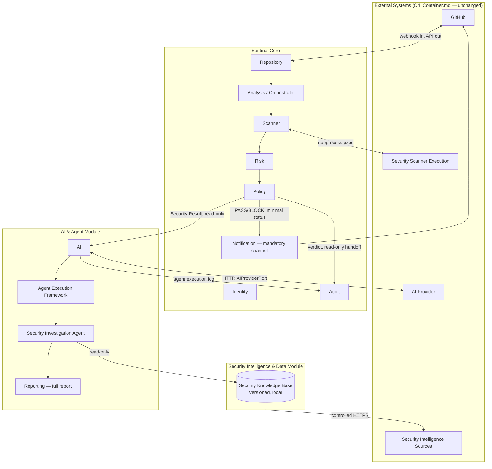

# Module Boundaries

## Purpose

This document formally defines SentinelAI's three internal modules — introduced in `AI_Agent_Architecture.md` §3 — as the authoritative module decomposition for the `SentinelAI Application` container from `C4_Container.md`. It states each module's responsibilities, network profile, dependencies, and communication contracts, and maps the existing 10 bounded contexts (`Architecture_Overview.md`) onto these three modules. This does not change the container boundary, add a deployable service, or override any principle in `Architecture_Principles.md` — it makes the internal module structure explicit and enforceable.

## The Three Modules

| Module | Responsibility | Decision authority | Network profile |
|---|---|---|---|
| **Sentinel Core** | All deterministic evaluation: classification, scanner coordination, correlation, risk assessment, security score, policy evaluation | Sole authority for PASS/BLOCK | Fixed, pre-authorized endpoints only: GitHub (webhook in, API out) and local scanner subprocess invocation — no arbitrary outbound access |
| **AI & Agent Module** | LLM interpretation, AI Enrichment, Agent Execution Framework, Security Investigation Agent, report generation | None | Fixed, pre-authorized endpoint only: the single configured AI Provider (`AIProviderPort`) — no arbitrary outbound access, no direct GitHub or scanner access |
| **Security Intelligence & Data Module** | Acquires and refreshes external security/remediation knowledge; maintains the Security Knowledge Base | None | The only module with open-ended, controlled access to external security intelligence sources |

**A note on "no Internet access."** Only the Security Intelligence & Data Module reaches an evolving, open-ended set of external hosts (advisory feeds, CVE databases). Sentinel Core and the AI & Agent Module each have exactly one fixed, pre-authorized network relationship — GitHub for Sentinel Core, the configured AI Provider for the AI & Agent Module — both already defined as external systems in `C4_Container.md`. Neither module can reach any other host. "No Internet access" means no arbitrary/open-ended access, not zero network sockets.

## Module Boundary Diagram



## Bounded Context → Module Mapping

| Bounded Context | Module | Notes |
|---|---|---|
| Identity | Sentinel Core | Authenticates and authorizes DevSecOps configuration access |
| Repository | Sentinel Core | GitHub adapter; the fixed, pre-authorized external relationship |
| Analysis (Orchestrator, classification, correlation) | Sentinel Core | Thin orchestration, per P-01 |
| Scanner | Sentinel Core | Coordinates and normalizes Scanner Execution results |
| Risk | Sentinel Core | Deterministic, per P-03 |
| Policy | Sentinel Core | Deterministic, sole verdict authority, per P-04 |
| Audit | Sentinel Core | Hosts the immutable trail; receives entries from both Sentinel Core and the AI & Agent Module |
| Notification (mandatory GitHub channel) | Sentinel Core | The guaranteed PASS/BLOCK status check must not depend on AI/Agent availability (Section 5) |
| AI | AI & Agent Module | Advisory-only, per P-02 |
| Reporting (full report) | AI & Agent Module | Combines the Security Result with the Security Investigation Agent's contribution |
| *(new)* Security Intelligence & Data | Security Intelligence & Data Module | Not one of the original 10 contexts — a new module supporting the Security Knowledge Base |

**Split responsibility for Notification/Reporting**: the mandatory Developer-facing GitHub status check and summary comment are minimal, deterministic, and emitted by Sentinel Core immediately upon a PASS/BLOCK verdict — they never wait on AI. The full DevSecOps-facing report, which includes AI-derived explanations, is assembled by the AI & Agent Module's Reporting responsibility and can complete later (Section 5). Both read from the same immutable Security Result; neither computes it.

## Dependency Direction

Dependencies flow one way, with no cycles:

```
Security Intelligence & Data Module ──(feeds)──▶ Security Knowledge Base
                                                          │
                                                    (read-only)
                                                          ▼
Sentinel Core ──(Security Result, read-only handoff)──▶ AI & Agent Module
```

- **Sentinel Core depends on nothing else in this diagram.** It can classify, scan, correlate, assess risk, and evaluate policy to a final PASS/BLOCK verdict with the AI & Agent Module and the Security Intelligence & Data Module entirely absent or unavailable. This is what makes QA-04 and the LLM-unavailable behavior in `AI_Agent_Architecture.md` §8 possible.
- **The AI & Agent Module depends on Sentinel Core** (it consumes the finished Security Result) **and on the Security Intelligence & Data Module** (it reads the Security Knowledge Base). It has no write path back into either.
- **The Security Intelligence & Data Module depends on nothing internal.** It refreshes the Security Knowledge Base on its own schedule, independent of any Analysis in progress.

No module may call back "upstream" against this direction. A future addition (a new agent, a new intelligence source) must fit this direction or it does not belong in this decomposition.

## Communication Contracts

| From | To | Mechanism | Data crossing the boundary |
|---|---|---|---|
| GitHub | Sentinel Core (Repository) | Webhook (HTTPS, signature-verified) | PR event payload |
| Sentinel Core (Repository) | GitHub | REST API (HTTPS) | PR context fetch, status check, comments |
| Sentinel Core (Scanner) | Security Scanner Execution | Subprocess exec | Artifact paths in; native scanner output or failure signal out |
| Sentinel Core (Policy) | Sentinel Core (Audit) | In-process call/event | Verdict-critical facts: Findings, Risk, Security Score, Policy version, verdict |
| Sentinel Core (Policy) | AI & Agent Module (AI) | In-process call, read-only handoff | The completed Security Result (immutable) |
| Sentinel Core (Policy) | Sentinel Core (Notification) | In-process event | PASS/BLOCK verdict only, for the mandatory GitHub channel |
| AI & Agent Module (AI) | AI Provider | HTTP (`AIProviderPort`) | Correlated Findings / Security Result context out; advisory text in |
| AI & Agent Module (Security Investigation Agent) | Security Knowledge Base | Read-only query | Knowledge entries or an explicit "no sufficient knowledge" result |
| AI & Agent Module | Sentinel Core (Audit) | In-process call | Agent execution log, tool calls, knowledge base versions used |
| Security Intelligence & Data Module | External security intelligence sources | Controlled HTTPS | Advisory/CVE/remediation feed data in |

No entry in this table allows the AI & Agent Module or the Security Intelligence & Data Module to write to a Finding, Risk value, Security Score, or Policy verdict — consistent with the Agent Restrictions in `AI_Agent_Architecture.md` §7.

## Why This Decomposition

The boundary is drawn around two things that must never mix: **decision authority** and **network exposure**. Sentinel Core holds all decision authority and touches only two fixed, well-understood external relationships, so nothing about the verdict can be affected by an unpredictable network response. The AI & Agent Module and the Security Intelligence & Data Module both touch more open-ended external content (LLM responses, security feeds) and therefore hold zero decision authority — whatever they produce is advisory or supportive, never authoritative. This is the same reasoning already established for AI in `Architecture_Principles.md` (P-02), extended here to the module level and to a second, previously undocumented external-facing responsibility (security intelligence acquisition).
