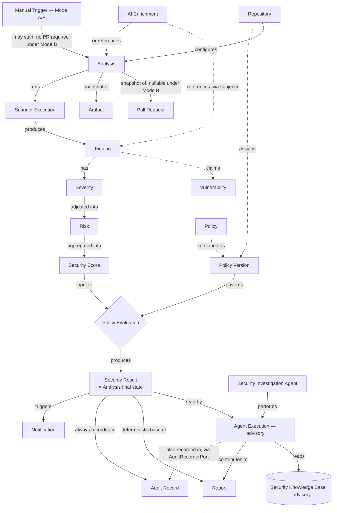

# Domain Concept Model

## Purpose

This document classifies every domain concept named in `Ubiquitous_Language.md`, states whether each has identity over time or is defined purely by its values, sketches its lifecycle, and flags which concepts are candidates for Aggregate Roots. It is the bridge between the shared vocabulary (already fixed) and the tactical DDD design in `Entities_Value_Objects.md` and `Aggregates_and_Boundaries.md`. Per the scope agreed for this document set, the transactional core (Analysis, Finding, Risk, Policy) is treated in full depth; Audit, Reporting, and Notification are treated more lightly as secondary concerns; and the AI & Agent Module's concepts are included, explicitly marked **advisory** — they participate in the domain vocabulary but never in verdict-critical consistency.

## Classification Legend

- **Entity** — has identity that persists across changes to its attributes.
- **Value Object (VO)** — has no identity of its own; two instances with the same values are interchangeable; immutable once created.
- **Aggregate Root candidate** — an Entity that is the entry point for consistency around a cluster of related objects (finalized in `Aggregates_and_Boundaries.md`).
- **External Reference** — a concept SentinelAI does not own or persist as a full domain object; it is referenced or described, not modeled with SentinelAI-owned lifecycle.
- **Advisory** — produced by the AI & Agent Module; never authoritative, never part of a verdict-critical consistency boundary.

## Concept Classification

| Concept | Category | Identity | Aggregate Root candidate? |
|---|---|---|---|
| Repository | Entity | Repository URL / provider identifier | Yes |
| Pull Request | External Reference (snapshot) | No independent SentinelAI identity — identified by provider PR number + repo | No — captured as a snapshot inside Analysis |
| Artifact | Value Object | Identified by value: path + type + content reference | No — held inside Analysis |
| Analysis | Entity | One per triggering event — a PR event (Mode A) or a manual trigger (Mode A or B, per `Domain_Events.md`) | **Yes — primary root** |
| Finding | Entity | Scanner + rule/category + location, scoped to one Analysis | No — held inside Analysis |
| Vulnerability | External Reference | Not modeled — the real-world referent a Finding claims to describe | No |
| Severity | Value Object | None — defined by its rating | No |
| Risk | Value Object | None — defined by its adjusted value + inputs | No |
| Security Score | Value Object | None — a computed aggregate value | No |
| Security Result | Value Object (immutable snapshot) | None — identified via its owning Analysis | No — it *is* Analysis's final state |
| Policy | Entity | Policy identifier, with versions | Yes |
| Policy Version | Value Object | Immutable once published; identified by version number | No — referenced by Analysis |
| Scanner | External Reference | The tool/capability itself, not persisted as domain state | No |
| Scanner Execution | Entity | Analysis + scanner, scoped to one run | No — held inside Analysis |
| Security Investigation Agent | External Reference — **Advisory** | The registered capability itself (like Scanner), not persisted as domain state | No |
| AI Enrichment | Advisory / Value Object | No independent identity — references a Finding/Analysis by `subjectId`, never embedded onto it | No |
| Report | Value Object (regenerable projection) | Identified via its owning Analysis; disposable | No |
| Audit Record | Entity | Append-only, own identity per event | Yes (secondary) |
| Notification | Entity | One per delivery attempt | Yes (secondary) |
| Agent Execution | Entity — **Advisory** | One per Security Investigation Agent run | Yes (secondary, advisory) |
| Security Knowledge Base Entry | Entity — **Data/Knowledge concept** | Versioned knowledge item | No — data-management boundary, not a domain aggregate |

## Core Domain Concepts

### Trigger & Scope
**Repository** is the only long-lived configuration entity a Pull Request belongs to; it carries scanner selection, assigned Policy version, and AI provider configuration. **Pull Request** and **Artifact** have no independent lifecycle in SentinelAI — they are captured as a snapshot at the moment an Analysis starts and never change after that; a new commit (synchronize event) produces a *new* Analysis with a *new* snapshot, never a mutation of the old one. An Analysis is not always PR-triggered: a DevSecOps manual trigger (`Application_Use_Cases.md` UC-2) can start one against an ad hoc artifact set with no Pull Request at all, in which case `PullRequestSnapshot` is simply absent (`Domain_Events.md`'s Mode B).

### Scanning & Findings
**Analysis** is the aggregate that owns the whole unit of work: it is created when a PR event arrives, transitions through scanning/correlation/risk/policy, and terminates in exactly one immutable Security Result. **Finding** has identity within one Analysis (it does not persist across Analyses, even for the same PR — a re-run produces new Finding instances) and is normalized before it enters the domain, per P-05. **Scanner Execution** is a short-lived Entity tracking one scanner's outcome (success/failure/timeout) within one Analysis; several Scanner Executions belong to one Analysis and can complete independently and out of order.

### Risk & Policy
**Severity**, **Risk**, and **Security Score** are all Value Objects — none has identity, each is a pure function of its inputs (P-03), and none is ever edited in place; a re-assessment produces a new value, not a mutation. **Policy** is the one Entity in this group: it has an identity that persists across many **Policy Versions**, each of which is an immutable Value Object once published. An Analysis references exactly one Policy Version — never "the current policy," always a specific, versioned snapshot, so a historical verdict remains reconstructable even after the Policy changes (QA-01).

### Governance & Output
**Security Result** is not a new persisted object — it is the Value Object view of Analysis's own final state (Findings + Risk + Security Score + Policy Version + verdict), which is why `Ubiquitous_Language.md` describes it as an aggregate of facts rather than a container with its own lifecycle. **Audit Record** and **Notification** are treated lightly here: each is its own small, append-only Entity, referencing an Analysis by identifier, but neither participates in Analysis's own consistency boundary — an Audit write or Notification delivery failing must never roll back or alter a Security Result already decided (Section 8 of `AI_Agent_Architecture.md`; `Aggregates_and_Boundaries.md` details the transaction split).

### AI & Agent Concepts (Advisory)
**AI Enrichment** is not modeled as an Entity — it is advisory text with no identity of its own, structurally excluded from carrying a verdict (P-02), and it references the Finding/Analysis it explains rather than being attached onto it (the link lives entirely on the AI Enrichment side — see `Data_Contracts.md`). **Security Investigation Agent** is classified like Scanner: an External Reference, a registered capability rather than persisted domain state. **Agent Execution** is an Entity — it has its own identity (one per Security Investigation Agent run), its own short lifecycle (started → running → completed/pending), and its own audit trail — but it is explicitly a *secondary*, advisory aggregate: nothing in Sentinel Core reads from it, and its absence or delay never blocks or changes a Security Result (the `AI Analysis: PENDING` behavior in `AI_Agent_Architecture.md` §8). Its one narrow write path is appending its own provenance to the Audit Record via `AuditRecorderPort` — it never touches Analysis, Finding, or Policy state. **Security Knowledge Base Entry** belongs to the Security Intelligence & Data Module — it is versioned Data, consumed read-only by the Security Investigation Agent, and is never written to by anything in Sentinel Core. Unlike Agent Execution, it is not tied to any Analysis and is not treated as a domain Aggregate at all — it is a data-management concept, kept at arm's length from the domain layer described in `Aggregates_and_Boundaries.md`.

## Concept Relationships

## Aggregate Root Candidates — Summary

| Candidate | Why | Detailed in |
|---|---|---|
| **Analysis** | Primary root — owns Findings, Scanner Executions, and the deterministic path to Security Result; the sole unit whose consistency is verdict-critical | `Aggregates_and_Boundaries.md` §Primary Aggregate |
| **Repository** | Owns its own configuration lifecycle, independent of any single Analysis | `Aggregates_and_Boundaries.md` §Secondary Aggregates |
| **Policy** | Owns its own version history, independent of any single Analysis | `Aggregates_and_Boundaries.md` §Secondary Aggregates |
| **Audit Record** | Append-only, own consistency, referenced by but not owned by Analysis | `Aggregates_and_Boundaries.md` §Secondary Aggregates |
| **Notification** | Independent delivery/retry lifecycle | `Aggregates_and_Boundaries.md` §Secondary Aggregates |
| **Agent Execution** *(advisory)* | Independent, non-blocking lifecycle; must never gate Analysis | `Aggregates_and_Boundaries.md` §Secondary Aggregates |

Analysis is the only root whose invariants are treated as verdict-critical; every other root above is deliberately kept outside that boundary so that its failure, delay, or absence cannot affect a PASS/BLOCK decision — consistent with QA-03, QA-04, and P-02/P-03/P-04.

**Security Knowledge Base Entry is deliberately excluded from this table.** It is not a domain Aggregate at any level — primary or secondary — because it has no relationship to any Analysis and carries no verdict-adjacent responsibility. It is a data-management concept owned entirely by the Security Intelligence & Data Module; see `Aggregates_and_Boundaries.md` §Data Management Boundary for how it is treated.
