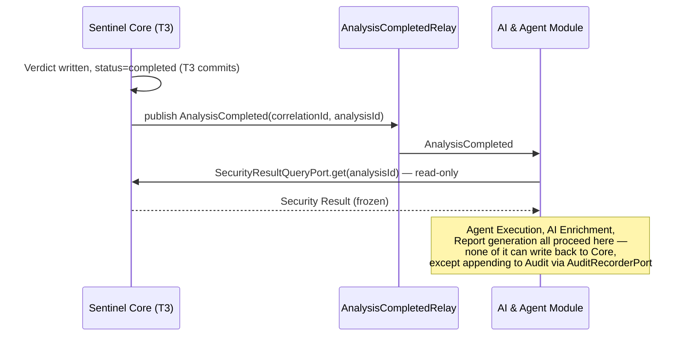

# Domain Events

## Purpose

This document formalizes the domain events sketched in `Architecture_Overview.md` and `Architecture_Patterns.md`: their producers, consumers, minimal payload, and — because GitHub can and does redeliver webhooks — the idempotency and correlation rules that keep re-delivery from ever producing a duplicate Analysis or a duplicate verdict.

## Event Design Rules

1. **Past tense, immutable fact.** An event describes something that already happened (`AnalysisCompleted`, not `CompleteAnalysis`). Once published, its payload never changes.
2. **Every Analysis-related event carries a `correlationId`.** Defined below. This is what lets a redelivered GitHub webhook be recognized as the same logical trigger, not a new one. Events with no relationship to any Analysis (currently, only `SecurityKnowledgeBaseEntryPublished` — see the Event Catalog) are the sole documented exception and carry no `correlationId` at all.
3. **Every event derived from an Analysis carries that Analysis's `analysisId`**, once one has been created. Events that precede Analysis creation (the raw webhook arrival) carry only `correlationId`.
4. **No event crosses back "upstream" against the module dependency direction in `Module_Boundaries.md`.** Nothing published by the AI & Agent Module or the Security Intelligence & Data Module is ever subscribed to by Sentinel Core.

## Correlation & Idempotency Rule

There are two distinct trigger shapes for an Analysis (`Application_Use_Cases.md` UC-1 and UC-2), and `correlationId` is generated differently for each. Conflating them would either force a fake PR reference onto ad hoc scans or silently drop the redelivery protection that PR-linked triggers need.

### Mode A — PR-linked trigger (UC-1 webhook, or UC-2 when DevSecOps re-runs against an existing PR)

**`correlationId` definition**: a deterministic value derived from `(repositoryId, prNumber, headCommitSha)`. Deterministic means: the same three inputs always produce the same `correlationId`, computed without any random or time-based component.

**Why `headCommitSha` and not just the PR number**: a GitHub `synchronize` event with a *new* commit is a legitimately new unit of work — a new Analysis, a new Security Result, per `Ubiquitous_Language.md`'s Terminology Rule 8 ("Analysis is singular per trigger"). A *redelivered* webhook for a commit already processed carries the *same* `headCommitSha`, and therefore the same `correlationId` — that is exactly the signal used to detect it.

**Idempotency rule**: before creating a new Analysis (T1 in `Aggregates_and_Boundaries.md`), Sentinel Core checks whether an Analysis already exists for this `correlationId`.
- If one exists (any status — `running` or `completed`): do not create a second Analysis. Treat the incoming trigger as a duplicate delivery. Log it and, if the existing Analysis is `completed`, it is safe to simply re-deliver the already-computed result to GitHub rather than recomputing anything.
- If none exists: proceed with T1 normally, and this becomes the `correlationId` for every event this Analysis produces from here on.

### Mode B — Ad hoc manual trigger (UC-2 without a PR reference — an arbitrary artifact set or branch)

There is no GitHub PR or commit to derive a natural, redelivery-safe identity from — an ad hoc scan is a direct, authenticated DevSecOps request, not an at-least-once delivery from an external system, so the redelivery risk that Mode A protects against does not apply here.

**`correlationId` definition**: `(repositoryId, manualTriggerKey)`, where `manualTriggerKey` is:
- an idempotency key DevSecOps explicitly supplies with the request, if they want a specific re-run to be recognized as the same trigger (e.g., retrying a request that timed out on the client side), **or**
- a freshly generated identifier (e.g., a UUID) if no key is supplied — in which case two otherwise-identical ad hoc requests are treated as two separate, legitimate Analyses, not duplicates.

**Idempotency rule**: applies only when a `manualTriggerKey` is explicitly reused. Without one, Mode B has no built-in deduplication — deliberately, since deduplicating human-initiated requests without an explicit key would risk silently dropping a second scan the DevSecOps engineer genuinely intended to run.

**Consequence for derived events**: regardless of mode, `ScannerExecutionCompleted`, `FindingsCorrelated`, `RiskAssessed`, `PolicyEvaluated`, and `AnalysisCompleted` all inherit the same `correlationId` as the triggering event that started their Analysis. A consumer that sees two events with the same `correlationId` and the same event type can safely treat the second as a duplicate and discard it under Mode A; under Mode B this guarantee only holds when a `manualTriggerKey` was supplied.

## Event Catalog

| Event | Producer | Consumers | Trigger | Minimal payload |
|---|---|---|---|---|
| `PullRequestReceived` | Sentinel Core | **Analysis Orchestrator** (creates the Analysis, then invokes Artifact Classification as its first step) | Webhook verified (Mode A), or manual trigger (UC-2, Mode A or B) | `correlationId`, `repositoryId`, `prNumber` (nullable — absent under Mode B), `headCommitSha` (nullable — absent under Mode B), `manualTriggerKey` (present only under Mode B), `changedFilePaths` |
| `ArtifactsClassified` | Sentinel Core | Scanner Selection | End of T1 classification step | `correlationId`, `analysisId`, `artifacts[]` |
| `ScannerExecutionCompleted` | Sentinel Core | Analysis Orchestrator (completion check), Audit | Each T2 commit | `correlationId`, `analysisId`, `scannerId`, `status` (succeeded/failed/timedOut), `findingIds[]` |
| `FindingsCorrelated` | Sentinel Core | Risk Assessment Service | Inside T3, once all eligible Scanner Executions reach a terminal state | `correlationId`, `analysisId`, `correlationGroups[]` |
| `RiskAssessed` | Sentinel Core | Security Score Calculation, Policy Evaluation | Inside T3 | `correlationId`, `analysisId`, `findingRisks[]` |
| `PolicyEvaluated` | Sentinel Core | Audit, Notification (mandatory channel) | Inside T3, verdict written | `correlationId`, `analysisId`, `verdict`, `policyVersionId`, `securityScore` |
| `AnalysisCompleted` | Sentinel Core | Audit, Notification, **AI & Agent Module** (Agent Execution Runner), Report Generation Service | Immediately after T3 commits | `correlationId`, `analysisId`, reference to the full Security Result |
| `AgentExecutionStarted` | AI & Agent Module | Audit | Agent Execution Runner begins | `correlationId`, `analysisId`, `agentExecutionId` |
| `AgentExecutionPending` | AI & Agent Module | Report Generation Service | LLM/provider unreachable at execution time | `correlationId`, `analysisId`, `agentExecutionId` — this is the event behind `AI Analysis: PENDING` |
| `AgentExecutionCompleted` | AI & Agent Module | Report Generation Service, Audit | T-Agent commits | `correlationId`, `analysisId`, `agentExecutionId`, reference to AI Enrichment output |
| `ReportSectionUpdated` | AI & Agent Module | Notification (enriched channels) | AI section transitions pending → complete | `correlationId`, `analysisId`, `reportId` |
| `NotificationDelivered` / `NotificationFailed` | Sentinel Core or AI & Agent Module | Audit | Each delivery attempt | `correlationId`, `analysisId`, `channel`, `attemptId`, `status` |
| `SecurityKnowledgeBaseEntryPublished` | Security Intelligence & Data Module | *(internal to the module only)* | T-Knowledge commits | `topic`, `version`, `publishedAt` — **no `correlationId`**, since it has no relationship to any Analysis (`Aggregates_and_Boundaries.md` §Data Management Boundary) |

**Note on `PullRequestReceived`'s consumer**: per P-01 (the Orchestrator is thin, but it *is* the coordinator), `PullRequestReceived` is consumed by the Analysis Orchestrator, which then calls the Artifact Classification Service directly as the first step of T1 — Artifact Classification does not subscribe to the event bus independently. This keeps the orchestration sequence (classify → select scanners → scan → correlate → assess → evaluate) visibly owned by one coordinator, consistent with `Domain_Services.md`'s classification of the Analysis Orchestrator as the Application Service that calls ports and services in sequence.

**Note on "Audit" as a consumer of AI & Agent Module events**: where the catalog above lists `Audit` as a consumer of `AgentExecutionStarted`, `AgentExecutionCompleted`, or a `NotificationDelivered`/`NotificationFailed` event produced by the AI & Agent Module, that delivery happens through `AuditRecorderPort` (`Ports_and_Interfaces.md`) — the one narrow, write-restricted Cross-Module Port — never through a shared, general-purpose event bus spanning both modules. Each module's `EventBusPort` remains private to that module.

## The `AnalysisCompleted` Boundary

`AnalysisCompleted` is the single hinge event between Sentinel Core and the AI & Agent Module, and it is deliberately one-directional and read-only:

Two rules follow directly from this diagram and from `Module_Boundaries.md`:
1. **No handler of `AnalysisCompleted` may call anything that writes to the Analysis Aggregate.** Its interactions with Sentinel Core are limited to the read-only `SecurityResultQueryPort` call and, separately, appending to Audit via `AuditRecorderPort` — the one documented write exception, scoped strictly to Audit Records and incapable of touching `Analysis`, `Finding`, or `Policy` state (`Ports_and_Interfaces.md`).
2. **`AnalysisCompleted` is published exactly once per Analysis**, immediately after T3 — never re-published if a later Agent Execution completes or a Report is regenerated. Those are new, distinct events (`AgentExecutionCompleted`, `ReportSectionUpdated`), not a re-emission of `AnalysisCompleted`.

## Explicitly Not Modeled as Separate Events

- **A failed Scanner Execution** does not get its own event type distinct from a succeeded one — `ScannerExecutionCompleted` carries `status` as data. Inventing `ScannerExecutionFailed` as a separate event type would risk a consumer treating failure as something structurally different from success, when the whole point of P-09/QA-03 is that failure is a normal, first-class outcome represented in the same shape.
- **Individual Finding creation** is not an event — Findings are produced in bulk per Scanner Execution and surface via `ScannerExecutionCompleted`'s `findingIds[]`, not one event per Finding.
- **Configuration changes** (Repository, Policy) are not covered in this catalog — they belong to `T-Repo` and `T-Policy` in `Aggregates_and_Boundaries.md` and, if events are needed for them, follow the same `correlationId`-less pattern as `SecurityKnowledgeBaseEntryPublished` (they relate to a Repository/Policy identity, not to any Analysis).
