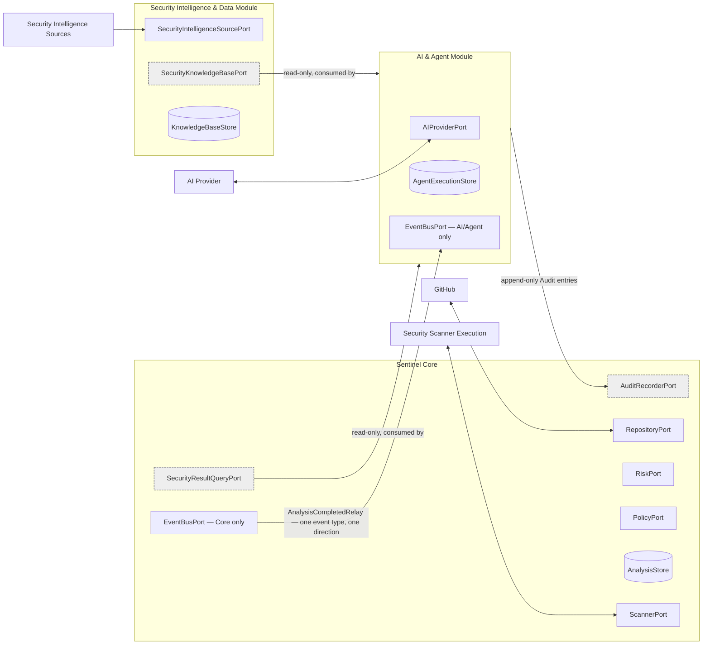

# Ports and Interfaces

## Purpose

This document catalogs every port in SentinelAI: its type, direction, contract, and adapter(s). It formalizes the ports already named informally across `Architecture_Principles.md`, `Module_Boundaries.md`, and `AI_Agent_Architecture.md`, and fixes one naming convention explicitly to avoid confusion once code exists.

## Naming Convention: Persistence Ports Are Never Called "Repository"

`Repository` is already a domain concept — the GitHub-backed entity a Pull Request belongs to (`Ubiquitous_Language.md`). Using the same word for a persistence-access interface (the common DDD "Repository pattern" name) would create two unrelated things called "Repository" in the same codebase. **Persistence ports in this document are always named `*Store`** — `AnalysisStore`, `PolicyStore`, `RepositoryConfigStore`, `AuditStore`, `AgentExecutionStore`, `KnowledgeBaseStore`. The domain concept keeps the name `Repository`; the GitHub-facing port keeps the name `RepositoryPort` (it is about the domain concept, not about persistence).

## Port Classification

- **Infrastructure Port**: crosses to a real external system (GitHub, a scanner subprocess, an AI provider, a security intelligence feed, or the local database file).
- **Internal Domain Port**: no external system involved, but kept as an interface so it can be substituted with a fake/fixture in tests (QA-05, QA-06).
- **Cross-Module Port**: crosses a module boundary defined in `Module_Boundaries.md`. The default for this category is **read-only**. There is exactly one documented exception — `AuditRecorderPort` — and it is scoped narrowly enough that it does not weaken the rule: see "The One Write Exception: AuditRecorderPort" below.

## The One Write Exception: AuditRecorderPort

`AuditRecorderPort` is the single documented exception to "Cross-Module Ports are read-only," and it is deliberately scoped so narrowly that it does not reopen the boundary it sits in:

- **What it allows**: the AI & Agent Module may append an Audit Record (agent execution log, tool calls made, Security Knowledge Base versions used) to Sentinel Core's Audit store.
- **What it does not allow**: it has no method that touches `Analysis`, `Finding`, `Policy`, `SecurityScore`, or `verdict` — none of that state is reachable through this port at all, not even for reading. Audit is the only Sentinel Core state the AI & Agent Module can write to; every other Sentinel Core state remains reachable only through `SecurityResultQueryPort`, which stays strictly read-only.
- **Why this is an exception rather than a rule change**: Audit Records are append-only by their own invariant (`Entities_Value_Objects.md`) — writing one never modifies, contests, or depends on any existing Analysis/Finding/Policy state, and an Audit write failing never rolls back or alters a Security Result already decided (`AI_Agent_Architecture.md` §9, `Aggregates_and_Boundaries.md`'s T-Audit transaction). Because an append-only write to a side ledger cannot influence a verdict, it does not carry the risk the read-only rule exists to prevent. This exception is already established in `Module_Boundaries.md`'s Communication Contracts table; this document names and scopes the port that implements it.

## Sentinel Core Ports

| Port | Type | Adapter(s) | Input | Output |
|---|---|---|---|---|
| `RepositoryPort` | Infrastructure | GitHub Adapter | PR reference / status+comment content | PR context (snapshot) / delivery confirmation |
| `ScannerPort` | Infrastructure | Semgrep, Bandit, Trivy, Gitleaks, Checkov adapters | Artifact paths | Invokes the scanner subprocess and receives its outcome: `NormalizedFinding[]` on success, or a failure/timeout signal (P-05, P-09) |
| `RiskPort` | Internal Domain | Risk Engine | Findings + heuristic config | Risk values (P-03) |
| `PolicyPort` | Internal Domain | Policy Engine | Findings, Risk, Security Score, `PolicyVersionId` | A **computed** PASS/BLOCK value only — this port has no write capability. Applying that value to the Analysis Aggregate (enforcing the write-once invariant) is done by `Analysis.recordVerdict(verdict)`, an Aggregate method invoked by the Analysis Orchestrator, not by this port (P-04; see `Domain_Services.md`'s "What Stays Inside an Aggregate") |
| `EventBusPort` | Internal Domain — **scoped to Sentinel Core only** | In-process pub/sub | Domain event | Delivery to subscribed handlers *within Sentinel Core* |
| `AnalysisStore` | Infrastructure (persistence) | SQLite adapter | Analysis Aggregate state | Persisted/retrieved Analysis rows (T1–T3) |
| `RepositoryConfigStore` | Infrastructure (persistence) | SQLite adapter | Repository Aggregate state | Persisted/retrieved Repository config (T-Repo) |
| `PolicyStore` | Infrastructure (persistence) | SQLite adapter | Policy Aggregate state | Persisted/retrieved Policy versions (T-Policy) |
| `AuditStore` | Infrastructure (persistence) | SQLite adapter | Audit Record | Persisted/retrieved Audit entries (T-Audit) |
| `NotificationStore` | Infrastructure (persistence) | SQLite adapter | Notification delivery attempt | Persisted/retrieved Notification records (T-Notify) |

**Compute vs. apply, for `PolicyPort` specifically**: `PolicyPort` (via the Policy Evaluation Service) *computes* what the verdict should be — a pure function over Findings, Risk, Security Score, and a Policy Version. It has no method to persist that value. Writing the verdict onto the Analysis Aggregate — and enforcing that this can only happen once — is `Analysis.recordVerdict(verdict)`, a method on the Aggregate itself, called by the Analysis Orchestrator as part of T3. This mirrors the general rule in `Domain_Services.md`: a Domain Service decides, an Aggregate method enforces how that decision is recorded.

## AI & Agent Module Ports

| Port | Type | Adapter(s) | Input | Output |
|---|---|---|---|---|
| `AIProviderPort` | Infrastructure | Ollama, OpenAI, Claude, Gemini adapters | Correlated Findings / prompt context | Advisory text (structurally excludes verdict/score fields — P-02) |
| `SecurityResultQueryPort` | **Cross-Module, read-only** | Exposed by Sentinel Core; no adapter substitution needed since it never leaves the process | `analysisId` | The frozen Security Result — no write method exists on this port at all |
| `SecurityKnowledgeBasePort` | **Cross-Module, read-only** | Exposed by the Security Intelligence & Data Module | Topic/category query | Matching `SecurityKnowledgeBaseEntry` values, or an explicit "no sufficient knowledge" result — no write method exists |
| `AgentExecutionStore` | Infrastructure (persistence) | SQLite adapter (own tables, per `Aggregates_and_Boundaries.md`) | Agent Execution state | Persisted/retrieved Agent Execution rows (T-Agent) |
| `EventBusPort` | Internal Domain — **scoped to the AI & Agent Module only** | In-process pub/sub | Domain event (`AgentExecutionStarted`, `AgentExecutionPending`, `AgentExecutionCompleted`, `ReportSectionUpdated`) | Delivery to subscribed handlers *within the AI & Agent Module* |
| `AnalysisCompletedRelay` | **Cross-Module, one event type only, one-directional** | A dedicated relay from Sentinel Core's `EventBusPort` to the AI & Agent Module's `EventBusPort` | The `AnalysisCompleted` event only | Delivers exactly one event type; it is not a general subscription to Sentinel Core's internal bus, and no other Sentinel Core event crosses through it |
| `AuditRecorderPort` | **Cross-Module, write-restricted to Audit only** | Exposed by Sentinel Core; called by the AI & Agent Module | Agent execution log, tool calls, Security Knowledge Base versions used | Appends an Audit Record only — this is the one narrow, explicit write the AI & Agent Module is permitted to make into Sentinel Core, and it can never touch `Analysis`, `Finding`, `Policy`, or any verdict-bearing state (`Module_Boundaries.md`'s Communication Contracts table already establishes this relationship; this port formalizes it) |

**Tool Registry ports** (internal to the Agent Execution Framework, consumed only by the Security Investigation Agent): `ReadFindingsTool`, `ReadRiskBreakdownTool`, `ReadSecurityScoreTool`, `ReadKnowledgeBaseTool`. Every one of these is read-only by construction — there is no write-capable tool registered for any agent in the MVP (`AI_Agent_Architecture.md` §7).

## Security Intelligence & Data Module Ports

| Port | Type | Adapter(s) | Input | Output |
|---|---|---|---|---|
| `SecurityIntelligenceSourcePort` | Infrastructure | One adapter per external feed/CVE source (Adapter pattern, mirroring `ScannerPort`) | Query/refresh request | Raw external advisory/remediation content |
| `KnowledgeBaseStore` | Infrastructure (persistence) | SQLite or dedicated file store adapter | `SecurityKnowledgeBaseEntry` | Persisted/retrieved, versioned (T-Knowledge) |

## Dependency Direction

No arrow in this diagram points from the AI & Agent Module or the Security Intelligence & Data Module into any Sentinel Core port other than `AuditRecorderPort` — and that one port's write surface is restricted to Audit Records only, never `Analysis`, `Finding`, or `Policy` state. Each module's `EventBusPort` is its own private instance; the only thing that crosses is the single `AnalysisCompletedRelay`, not general access to either bus.

## Port Contract Summary

| Port | Direction | Read/Write | Consumer |
|---|---|---|---|
| `RepositoryPort` | Sentinel Core ↔ GitHub | Read (fetch context) + Write (status/comments) | Analysis Orchestrator |
| `ScannerPort` | Sentinel Core ↔ Scanner Execution | Invoke (subprocess execution) + Read (results) | Scanner coordination |
| `RiskPort` | Internal to Sentinel Core | Read (compute) | Risk Assessment Service |
| `PolicyPort` | Internal to Sentinel Core | Read (compute only) — produces a verdict *value*; never writes it | Policy Evaluation Service |
| `EventBusPort` (Sentinel Core instance) | Internal to Sentinel Core | Publish/subscribe, scoped to Sentinel Core | Analysis Orchestrator and its internal handlers |
| `EventBusPort` (AI & Agent Module instance) | Internal to the AI & Agent Module | Publish/subscribe, scoped to that module | Agent Execution Runner, Report Generation Service |
| `AnalysisCompletedRelay` | Sentinel Core → AI & Agent Module | **One event type, one direction, no other traffic** | Agent Execution Runner |
| `AuditRecorderPort` | AI & Agent Module → Sentinel Core (Audit) | **Write, restricted to Audit Records only** | Audit |
| `AIProviderPort` | AI & Agent Module ↔ AI Provider | Read (advisory response) | AI Enrichment Service |
| `SecurityResultQueryPort` | AI & Agent Module ← Sentinel Core | **Read-only** | Agent Execution Runner |
| `SecurityKnowledgeBasePort` | AI & Agent Module ← Security Intelligence & Data Module | **Read-only** | Security Investigation Agent |
| `SecurityIntelligenceSourcePort` | Security Intelligence & Data Module ↔ external sources | Read (acquire) | Knowledge Refresh Service |
| `*Store` ports (Analysis, RepositoryConfig, Policy, Audit, Notification, AgentExecution, KnowledgeBase) | Each module ↔ its own persistence | Read + Write, scoped to the owning module only | The Aggregate/Entity each store persists |

## Rule Recap

- Persistence ports are always `*Store`, never `Repository` — the word `Repository` is reserved for the domain concept.
- `SecurityResultQueryPort` and `SecurityKnowledgeBasePort` are read-only with no exception path — there is no configuration or future flag that adds a write method to either.
- `AuditRecorderPort` is the one documented write exception among Cross-Module Ports, and it is restricted to Audit Records only — it can never be extended to write `Analysis`, `Finding`, `Policy`, or verdict-bearing state.
- `PolicyPort` computes a verdict value; it never writes it. Writing is `Analysis.recordVerdict(verdict)`, an Aggregate method — not a port operation.
- `EventBusPort` is never a single, cross-module infrastructure port. Each module has its own private instance; the only thing that legitimately crosses module boundaries is the single-event `AnalysisCompletedRelay` (Sentinel Core → AI & Agent Module) and the write-restricted `AuditRecorderPort` (AI & Agent Module → Sentinel Core's Audit, and Audit only).
- No `*Store` port is shared across modules — each module owns and accesses only its own persistence, consistent with `Aggregates_and_Boundaries.md`'s one-aggregate-one-transaction rule.
