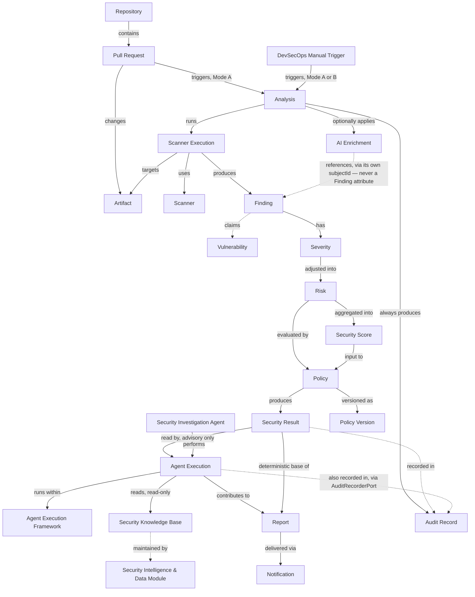

# SentinelAI Ubiquitous Language

## Purpose

This document fixes the meaning of the terms used across SentinelAI's code, documentation, and conversation. Its job is to remove ambiguity between concepts that sound similar (Finding vs. Vulnerability, Severity vs. Risk, Report vs. Notification) so that architecture, domain model, and implementation all use the same word for the same thing. Every bounded context, port, and event name introduced elsewhere (`Architecture_Overview.md`, `Security_Decision_Flow.md`, `Architecture_Principles.md`) must be consistent with the definitions here. If a future decision needs a term that contradicts this document, that is itself an architectural decision and belongs in `09_Decisions`, not a silent renaming.

## Core Concepts

### Repository

**Definition**: A source-code repository hosted on a Git provider (GitHub for the MVP) that SentinelAI is configured to analyze. SentinelAI does not own the Repository — it holds a reference to it (URL, identifier, branch rules) plus the configuration DevSecOps has attached to it (which scanners apply, which policy version governs it).

**Responsibilities**: Identifies which codebase a Pull Request belongs to; scopes configuration (scanners, policy, AI provider) per repository; scopes the audit trail per repository.

**Not to be confused with**: the Git provider itself (GitHub), or the working copy/checkout used during an Analysis (that is an ephemeral artifact of Scanner Execution, not the Repository concept).

### Pull Request

**Definition**: The unit of change that triggers SentinelAI. Conceptually, a Pull Request **is** the GitHub PR — SentinelAI does not maintain its own abstraction of "a proposed change" independent of GitHub. But SentinelAI never holds a live, mutable copy of it: what enters the domain is a single, read-only snapshot (number, base/head branch, author, changed files) captured once, at the moment an Analysis starts, fetched through the `RepositoryPort` and never represented downstream as a native GitHub SDK type (P-08). This is why `Domain_Concept_Model.md` classifies Pull Request as an **External Reference (snapshot)**, not a domain-owned Entity or Value Object: SentinelAI describes and reacts to the PR, it does not own or persist its lifecycle. There is exactly one definition — "is the GitHub PR" describes what it refers to; "External Reference (snapshot)" describes how SentinelAI represents that reference internally. Under a Mode B ad hoc manual trigger (`Domain_Events.md`), there is no Pull Request at all — the snapshot is simply absent.

**Responsibilities**: Identifies *what changed* and, when present, triggers exactly one Analysis per relevant event (opened, synchronize).

**Not to be confused with**: the Analysis itself (when a Pull Request is present, it is the trigger and the subject; the Analysis is the work performed on it). Not every Analysis has a Pull Request behind it — see Analysis.

### Artifact

**Definition**: A single file included in an Analysis's input/change set, classified by type so the right scanners can be selected for it. This is deliberately not scoped to "a Pull Request" — under a Mode A (PR-linked) trigger the change set comes from the Pull Request's changed files, but under a Mode B (ad hoc manual) trigger there is no Pull Request at all, only the artifact set DevSecOps specified directly (`Domain_Events.md`). Artifact types include: application source code, Dockerfiles, Kubernetes/Helm manifests, Terraform/IaC, GitHub Actions workflow files, dependency manifests (e.g., `requirements.txt`, `package.json`), and any other file eligible for secret scanning.

**Responsibilities**: Determines which scanners are applicable (Scanner Selection); scopes what a Finding refers to (a Finding always points back to one or more Artifacts and their locations).

**Not to be confused with**: a Finding (an Artifact is *what is scanned*; a Finding is *what a scan produces*).

## Security Concepts

### Finding

**Definition**: A single, normalized security observation reported by a scanner and translated into the common `NormalizedFinding` model. A Finding always carries: the artifact/location it refers to, the scanner that produced it, a category, and an intrinsic severity. A Finding never carries AI Enrichment content directly — if one exists, it is linked from the AI Enrichment side (see AI Enrichment, below), never embedded in or attached onto the Finding itself. This is what keeps a completed Finding fully immutable regardless of when, or whether, enrichment ever arrives.

**Responsibilities**: The atomic unit that flows through the pipeline — normalized findings are correlated, risk-assessed, optionally enriched by AI, and evaluated against Policy.

**Not to be confused with**: raw scanner output (a Finding only exists *after* normalization — no downstream component ever sees a scanner's native format, per P-05).

### Vulnerability

**Definition**: The real-world security weakness that a Finding *claims* to describe (e.g., "this dependency has CVE-2024-XXXX," "this code path allows SQL injection"). A Vulnerability is the referent; a Finding is SentinelAI's normalized, tool-produced record of it.

**Responsibilities**: Not directly modeled as a first-class SentinelAI entity — it exists conceptually so the distinction below is unambiguous.

**Not to be confused with**: Finding. They are not equivalent: two different scanners can produce two different Findings for the same underlying Vulnerability (this is exactly what Correlation groups together), and a Finding can also be a false positive — a Finding claiming a Vulnerability that does not actually exist. SentinelAI's domain manipulates Findings; it never asserts a Vulnerability is real independent of what a Finding (or a correlated group of Findings) reports.

### Severity

**Definition**: The intrinsic rating a scanner assigns to a Finding at normalization time (e.g., critical/high/medium/low, or a CVSS-derived score), before any SentinelAI-specific context is applied.

**Responsibilities**: The starting input to Risk Assessment. Severity by itself does not account for where in the codebase the Finding occurred or how many related Findings exist.

**Not to be confused with**: Risk (Severity is tool-assigned and context-free; Risk is SentinelAI's own, context-adjusted assessment).

### Risk

**Definition**: The deterministic, SentinelAI-computed adjustment of a Finding's Severity based on configurable heuristics: path patterns (e.g., a finding in a test file vs. production code), artifact type, and correlation density (how many independent signals point to the same underlying Vulnerability). Produced exclusively by the Risk Engine (P-03) — never by AI.

**Responsibilities**: Turns a generic, tool-assigned Severity into a contextual signal specific to this codebase and this PR. Feeds directly into Policy Evaluation as the deterministic input for thresholds.

**Not to be confused with**: Severity (Risk is derived *from* Severity plus context; it is not a synonym for it), or Security Score (Risk is per-Finding; Security Score is the aggregate).

### Security Score

**Definition**: A single deterministic numeric/qualitative measure summarizing the overall risk posture of a Pull Request, computed by aggregating all risk-assessed Findings for that Analysis. Calculated by the Risk Engine as part of Risk Assessment, before Policy Evaluation runs.

**Responsibilities**: Gives DevSecOps and Developer a single at-a-glance signal; is one of the inputs Policy rules can threshold against (e.g., "block if Security Score < 70"), alongside individual Finding-level rules.

**Not to be confused with**: the PASS/BLOCK verdict itself. The Security Score is an input to Policy Evaluation, not its output — a low score does not automatically mean BLOCK unless a Policy rule says so. Only Policy produces the verdict (P-02, P-04).

### Security Result

**Definition**: The complete outcome of one Analysis: the set of risk-assessed, correlated Findings; the Security Score; the PASS/BLOCK verdict; and the policy version/rule(s) that produced it. This is the immutable final state of the Analysis, fixed the moment T3 commits (`Aggregates_and_Boundaries.md`) — not a separate Aggregate. `Analysis` is the one Aggregate Root; "Security Result" is simply the name for what that Aggregate looks like once `status = completed`.

**Responsibilities**: The single source of truth that Report generation, GitHub status/comments, and Notification all read from — each is a different *representation* of the same Security Result, not a separate computation of it.

**Not to be confused with**: Report or Notification (see Output Concepts) — those are presentations of a Security Result, not the Security Result itself.

## Analysis Concepts

### Analysis

**Definition**: The unit of work triggered by one Analysis-triggering event — either a Pull Request event (opened or synchronize) or a DevSecOps-initiated manual trigger, including an ad hoc trigger with no Pull Request involved (`Application_Use_Cases.md` UC-1/UC-2; `Domain_Events.md`'s Mode A/Mode B). An Analysis's verdict-critical path runs classification → scanning → normalization → correlation → risk assessment → policy evaluation, and terminates in exactly one immutable Security Result the moment that path commits (T3, per `Aggregates_and_Boundaries.md`). AI enrichment, Agent Execution, Report generation, Notification delivery, and Audit recording all happen **after** that point, as separate, non-blocking steps outside the critical transaction — they consume the already-fixed Security Result, they do not participate in producing it. An Analysis has a lifecycle (started, running, completed) and always terminates in exactly one Security Result.

**Responsibilities**: The top-level entity the Orchestrator coordinates; the unit the Audit trail records against; the unit re-run when a PR is synchronized with new commits, or when DevSecOps issues a new manual trigger (a new Analysis, not a continuation of the old one).

**Not to be confused with**: Scanner Execution (an Analysis contains many Scanner Executions — one Analysis, N scanners run within it).

### correlationId

**Definition**: The identifier that ties one triggering event to the exactly-one Analysis it may create, and that every event/record derived from that Analysis carries onward. It is not itself a domain Entity or Value Object with independent meaning — it exists purely to make triggering idempotent.

**Responsibilities**: Generated one of two ways, per `Domain_Events.md`: **Mode A**, deterministically from `(repositoryId, prNumber, headCommitSha)` for any PR-linked trigger — this is what lets a redelivered GitHub webhook be recognized as the same trigger, not a new one; or **Mode B**, from `(repositoryId, manualTriggerKey)` for an ad hoc manual trigger with no PR, where deduplication only occurs if DevSecOps explicitly supplies the same key twice.

**Not to be confused with**: `analysisId` — `correlationId` identifies the *trigger*; `analysisId` identifies the *Analysis* that trigger produced. The two are related but not interchangeable: a `correlationId` can arrive before any Analysis exists (e.g., a webhook still being checked for idempotency), while an `analysisId` only exists once T1 has committed.

### Scanner

**Definition**: A capability — "the ability to detect a class of security issue in a class of artifact" (SAST, SCA, container, IaC, secrets) — realized in the MVP by a specific external tool (Semgrep, Bandit, Trivy, Gitleaks, Checkov) accessed through a dedicated adapter implementing `ScannerPort`.

**Responsibilities**: Each Scanner is selected based on Artifact type (Strategy pattern) and is solely responsible, via its adapter, for translating its own native output into `NormalizedFinding` (P-05).

**Not to be confused with**: Scanner Execution (Scanner is the capability/tool; Scanner Execution is one concrete, time-bounded invocation of it).

### Scanner Execution

**Definition**: One concrete, isolated invocation of a Scanner against a specific set of Artifacts, within the Security Scanner Execution container (a subprocess, or in the future a Docker worker). Has its own outcome independent of the rest of the Analysis: succeeded with N findings, succeeded with zero findings, timed out, or crashed.

**Responsibilities**: The unit that Failure Isolation (QA-03, P-09) is defined against — one Scanner Execution failing must never be interpreted as "no vulnerabilities found," and must never abort the containing Analysis.

**Not to be confused with**: Scanner (the tool/capability) or Analysis (the whole PR-level unit of work that contains many Scanner Executions).

### AI Enrichment

**Definition**: The optional stage where the AI Provider (Ollama or an API provider) receives correlated Findings and returns advisory text: plain-language explanation, remediation suggestions, and deduplication of near-identical Findings for readability. An AI Enrichment record references the Finding or Analysis it explains — never the reverse; a Finding holds no pointer to its own enrichment (`Data_Contracts.md`).

**Responsibilities**: Improves the human-readability of a Security Result. Nothing more.

**Not to be confused with**: Risk Assessment or Policy Evaluation. AI Enrichment **cannot** decide, influence, or be consulted for Severity, Risk, Security Score, or PASS/BLOCK — its output type structurally excludes a verdict field (P-02). If the AI Provider is unavailable, the Analysis proceeds without it; nothing about the Security Result's deterministic parts changes (QA-04).

## AI & Agent Concepts (Advisory)

These terms formalize the internal structure defined in `AI_Agent_Architecture.md` and `Module_Boundaries.md`. All are **advisory** — none has decision authority, and none may block, delay, or influence a Security Result (P-02).

### Security Intelligence & Data Module

**Definition**: The one internal module authorized to reach external security intelligence sources (advisory feeds, CVE databases, remediation references) and to store what it acquires locally, in versioned form, for internal use.

**Responsibilities**: Refreshes and maintains the Security Knowledge Base. Holds no decision authority and has no relationship to any specific Analysis — it operates on its own refresh cycle.

**Not to be confused with**: Sentinel Core or the AI & Agent Module — neither of those two modules reaches arbitrary external hosts; only this module does, and only for security intelligence, never for anything verdict-related.

### Security Knowledge Base

**Definition**: The local, versioned store of security and remediation knowledge produced by the Security Intelligence & Data Module. It is data, not domain state — it has no relationship to any individual Analysis, Finding, or verdict. Each individual, immutable, versioned record within the store is a **Security Knowledge Base Entry**; "the Security Knowledge Base" refers to the store as a whole, while "an Entry" refers to one specific piece of guidance within it.

**Responsibilities**: The only external-knowledge source the Security Investigation Agent may draw on when assembling remediation guidance. Entries are immutable once published; a refresh creates a new version rather than editing an old one.

**Not to be confused with**: a Finding or a Security Result — the Knowledge Base holds general, reusable guidance, not the outcome of any particular Analysis. It is also not itself a domain Aggregate on the same footing as Analysis, Repository, or Policy — see `Aggregates_and_Boundaries.md`, where it is treated as a data-management boundary owned by the Security Intelligence & Data Module.

### Agent Execution Framework

**Definition**: The reusable internal infrastructure that runs agents inside the AI & Agent Module — providing an Agent Registry, a Tool Registry, per-agent permissions, bounded context/state, guardrails, execution limits, and auditing.

**Responsibilities**: Hosts and constrains every agent (the Security Investigation Agent today, future agents later) so that adding a new agent is a configuration/registration exercise, not a redesign.

**Not to be confused with**: any individual agent, or with an Agent Execution (a single run). The Framework is the infrastructure; the agent is a registered capability within it; an Agent Execution is one instance of that capability running.

### Security Investigation Agent

**Definition**: The first agent registered in the Agent Execution Framework. Its role is to investigate and explain an already-completed Security Result — not to test, scan, or decide anything.

**Responsibilities**: Reads Findings, Risk, and the Security Score breakdown from a completed Analysis (via `SecurityResultQueryPort`, read-only); reads relevant Security Knowledge Base entries (read-only); and produces advisory output (explanation, prioritization, remediation guidance) as an Agent Execution, primarily during report generation.

**Not to be confused with**: the Agent Execution Framework (the infrastructure that hosts it) or an Agent Execution (one specific run of it). It also never orchestrates scanners or re-runs any part of Sentinel Core's deterministic evaluation (`AI_Agent_Architecture.md` §4, §7).

### Agent Execution

**Definition**: One concrete, time-bounded run of a registered agent (for the MVP, the Security Investigation Agent) against one Analysis's already-completed Security Result.

**Responsibilities**: Produces advisory output (explanation, prioritization, remediation guidance) plus its own provenance log (tool calls made, Security Knowledge Base versions consulted). Never writes to the Analysis it reads from — the one narrow exception is appending its own provenance to the Audit Record, via `AuditRecorderPort`, which cannot touch `Analysis`, `Finding`, or `Policy` state (`Ports_and_Interfaces.md`).

**Not to be confused with**: the Analysis itself, or with Scanner Execution — an Agent Execution runs after Sentinel Core has already finished, reads only, and can be `pending-unavailable` indefinitely without affecting anything it references.

## Governance Concepts

### Policy

**Definition**: The explicit, versioned, DevSecOps-authored set of rules and thresholds evaluated against a Security Result's risk-assessed Findings and Security Score to produce exactly one verdict: PASS or BLOCK. Policy is configuration, not code — a change to Policy is a data change tracked by version, not a deployment.

**Responsibilities**: The **only** thing in SentinelAI allowed to produce a PASS/BLOCK verdict (P-04). Given the same (Findings, Risk, Policy-version) triple, Policy Evaluation is deterministic — same inputs, same verdict, every time (QA-02).

**Not to be confused with**: Risk Assessment (Risk adjusts severity per Finding; Policy decides the verdict from the whole risk-assessed set) or AI Enrichment (Policy never calls or depends on the AI Provider).

### Audit Record

**Definition**: An immutable entry describing one significant event: an Analysis run and its Security Result, or a configuration/Policy change made by DevSecOps. Every Audit Record captures who, when, what, and result — enough to fully reconstruct a historical verdict without needing scanner logs or AI provider logs.

**Responsibilities**: Must record, at minimum: every completed Analysis (Findings, Risk, Security Score, Policy version, rule(s) applied, verdict); every DevSecOps configuration or Policy change; and any degraded outcome (scanner failure, AI unavailability, persistence failure) distinct from a normal completion. This is what makes QA-01 (100% of historical verdicts reconstructable) achievable.

**Not to be confused with**: a Report (a Report is a human-facing document generated *from* data that includes Audit Records among other things; the Audit Record itself is the durable, immutable domain fact).

## Output Concepts

### Report

**Definition**: A generated, human-readable **representation** of a Security Result, produced for a specific audience. Two representations exist in the MVP: the Developer-facing summary (GitHub status check + inline/summary comments, redacted) and the DevSecOps-facing full report (Markdown/SARIF/JSON/HTML, unredacted).

**Responsibilities**: Translates the domain-level Security Result into a format and level of detail appropriate for its reader, applying redaction rules (e.g., never showing a raw secret value to a Developer).

**Not to be confused with**: the Security Result (the Report is a *view* of it — regenerating a Report from the same Security Result must always produce the same content; the Report holds no independent truth).

### Notification

**Definition**: The act and channel of *delivering* a Report or a summary of a Security Result to somewhere outside SentinelAI — the GitHub status check/comments (MVP, mandatory), and Slack/Teams/email/webhooks (near-term, additional channels).

**Responsibilities**: Delivery only — routing, formatting-for-channel, and respecting the same redaction rules as any Developer-facing Report.

**Not to be confused with**: the Security Result or the Report. The distinction is *content vs. delivery*: the Security Result is the fact, the Report is a formatted view of that fact, and the Notification is the act of pushing that view to a destination. A Notification failure (e.g., Slack webhook unreachable) is a delivery problem — it must never be confused with, or allowed to change, the underlying Security Result.

## Relationships

## Terminology Rules

1. **A Finding is never a Vulnerability.** Code and documentation must say "Finding" when referring to SentinelAI's normalized record, and reserve "Vulnerability" for the underlying real-world weakness being described.
2. **Severity is scanner-assigned; Risk is SentinelAI-assigned.** Never use the two words interchangeably in code, schemas, or documentation.
3. **Only Policy produces a verdict.** No other component, including AI Enrichment or Risk Assessment, may use the words "PASS," "BLOCK," "approve," or "verdict" in its own output or documentation — those terms belong exclusively to Policy Evaluation.
4. **AI Enrichment is additive, never authoritative.** Any text describing what AI "decides" or "determines" about a Finding's outcome is a terminology violation — AI *explains*, *suggests*, and *deduplicates*; it does not decide.
5. **Report ≠ Security Result.** A Report is regenerable and disposable; the Security Result and its Audit Record are the durable facts. Do not persist a Report as if it were the source of truth.
6. **Notification ≠ Report.** "Sending a notification" means delivering a representation somewhere; it is not a separate computation. If a Notification and a Report ever disagree, that is a bug in delivery, not a second, competing truth.
7. **Scanner vs. Scanner Execution.** "The Trivy scanner failed" is ambiguous and should be avoided — say "this Scanner Execution (Trivy) failed" to keep the tool (stable, reusable) distinct from one run of it (transient, per-Analysis).
8. **Analysis is singular per trigger.** Do not use "Analysis" to refer to the whole system's ongoing activity — each triggering event (a Pull Request event, or a DevSecOps manual trigger) produces exactly one Analysis with one Security Result.
9. **The Security Knowledge Base is data, not a decision.** It is maintained by the Security Intelligence & Data Module and read by Agent Execution; it never appears as an input to Risk or Policy, and it is never treated as a domain Aggregate on the same level as Analysis, Repository, or Policy.
10. **An Agent Execution is never a Scanner Execution.** The former runs after Sentinel Core has finished and only reads; the latter runs during Sentinel Core's evaluation and produces Findings. Do not use "execution" alone where the distinction matters.
11. **`correlationId` is never assumed to imply a Pull Request.** A `correlationId` exists under both Mode A (PR-linked) and Mode B (ad hoc manual trigger); code and documentation must not treat its presence as proof that a `prNumber` or `headCommitSha` also exists.
